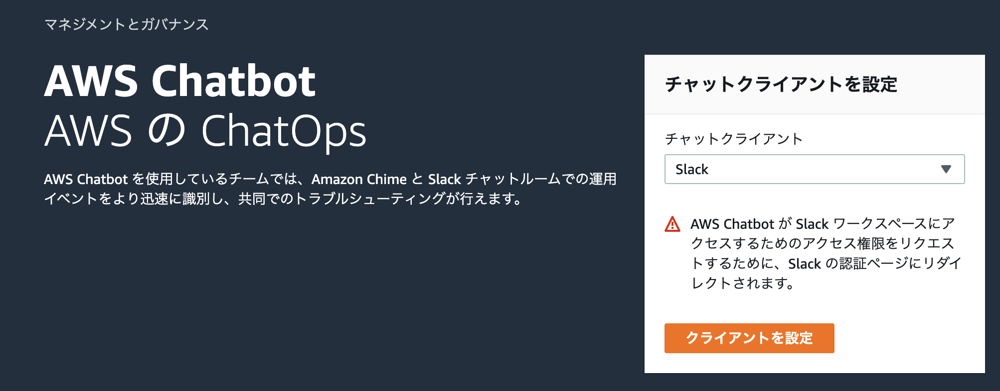
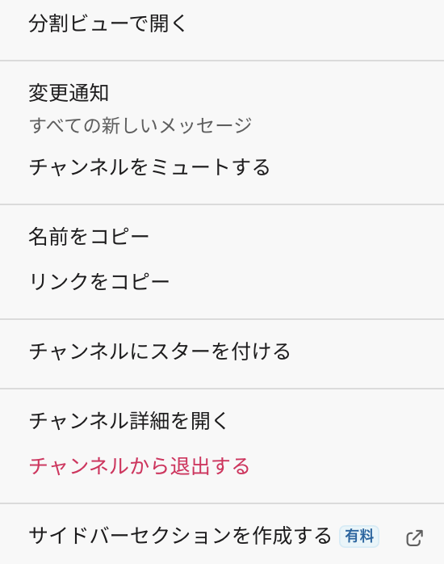

# lambda-notify
AWS LambdaのError/Warningを検知しSlackに通知する。

# Requirement
- aws-cli >= 2.4.28
- GNU Make >= 4.3

# Usage

## Slackワークスペースの認証とワークスペースID取得


[AWS Chatbot](console.aws.amazon.com/chatbot/home#/home)にて チャットクライアントを `Slack` に選択して `クライアントを設定` ボタンを押下し、SlackのWorkspaceを認証させ、AWS ChatbotのワークスペースIDを払い出す。
払い出されたワークスペースIDをMakefileの`TARGET_WORKSPACE_ID`に記述する。

## 通知対象のSlack channel IDのの取得

Slackの通知対象のチャンネルにて右クリックメニューの`リンクをコピー`を選択。

`https://<Work spacke>.slack.com/archives/<Channel ID>`

のようなリンクを取得できるので`<Channel ID>`の部分をMakefileの`TARGET_CHANNEL_ID`に記述する。


## Makefileへ環境値を設定する
以下の値を設定する。

| 変数名 | 値の説明 |
| --- | --- |
| AWS_ACCESS_KEY_ID | Your AWS access key ID |
| AWS_DEFAULT_REGION| Your AWS default region |
| LAMBDA_FUNCTION_NAME| Target lambda function name |
| TARGET_WORKSPACE_ID| AWS slack workspace ID |
| TARGET_CHANNEL_ID | Slack channel ID |

## CloudWatch AlarmおよびSNSを作成する
```bash
make deploy-cloudwatch_alarm
```

## ChatBotのSlackチャネルおよびIAMを作成する
```bash
make deploy-chatbot
```
